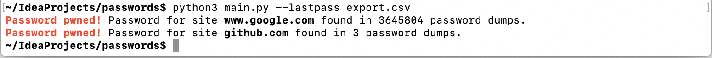
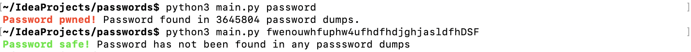
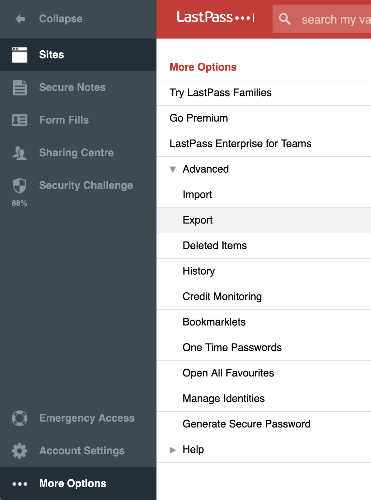

# Are any of your lastpass passwords leaked in password dumps?



Check if any of your lastpass passwords have been leaked using [Troy Hunt's](https://www.troyhunt.com/) [haveibeenpwned.com/Passwords](https://haveibeenpwned.com/Passwords)

## Usage

First install dependencies

```bash
$ pip3 install -r requrements.txt
```
To check a lastpass export csv file

```bash
$ python3 main.py --lastpass export.csv
```


Or check to check an individual password just enter your password

```bash
$ python3 main.py password
```




## Get lastpass export file

You can get the csv file for the export by going to lastpass -> More Options -> Advanced -> Export



## How it works

Uses [Troy Hunt's](https://www.troyhunt.com/) incredibily useful website [haveibeenpwned.com](https://haveibeenpwned.com/Passwords) 
to check passwords against leaked password dumps.

You can also check indivudial passwords of your choice using this script - it gives you the same information as [haveibeenpwned.com/Passwords](https://haveibeenpwned.com/Passwords) but you probably shouldn't trust a website asking for passwords (even if it is Troy's site). Troy's API uses K-anonymity to protect your password - only the first five characters of the SHA1 hash of the passwords are sent to the server. [Mike Pound has a great video describing how it works](https://www.youtube.com/watch?v=hhUb5iknVJs).

